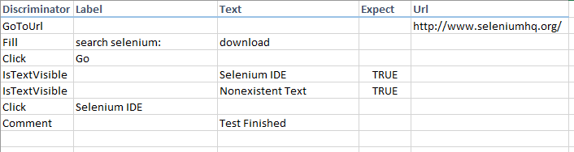
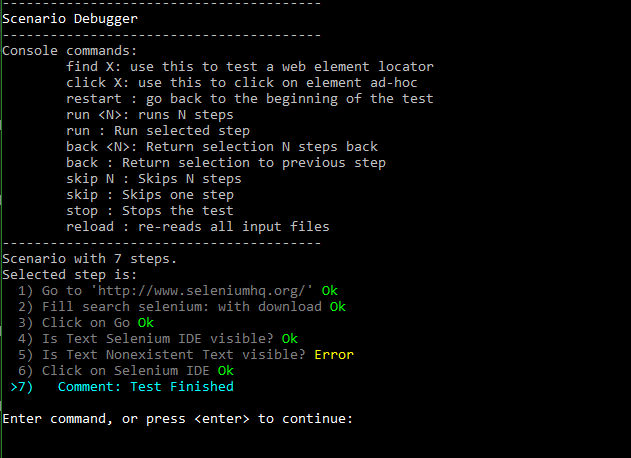

## Synopsis

Gears is a keyword-driven test automation tool for enterprise applications usable by non-technical people as well as automation specialists. The key quality of Gears is to allow testers to compose their tests solely out ot human readable commands, using no programmatic descriptors but instead use intuitive english instructions based on visible screen text and relative positions of application elements.

As result, tests written with Gears are far less prone to application web source code changes, as well to technical maintenance issues related to complex changing test-ware design.

Gears works as a standalone application serving as test interpreter/debugger. Tests themselves are written in a plain document format (Excel, CSV, HTML) and can be run on server (Gears being a console application hosted by conventional integration server), and can also be debugged locally using a simple console user interface.

The program itself is written in Microsoft .NET and is licenced under GNU GENERAL PUBLIC LICENSE.

## Motivation

The main goal of Gears is to enable simple automation tasks to be done in simple way with little or no technical skill. Gears automated scenarios are by definition human-readable and can thus be used both for automated execution as well as document the scenarios for manual testers - i.e. there can be only one document for both activities.

Gears do not require any scripting knowledge and thus do not need users to 'learn Gears' as a separate skill as they would in conventional test automation IDE. Instead Gears simply interpret a short list of english commands so the actual learning process can e managed within a day or less.

Gears aims also to minimize maintenance effort for automated tests by avoiding white-box location methods such as xPath or css, and instead uses own heuristical algorithms to locate elements based on intuitive descriptions like 'click 1st button under Login'. 

Ultimately the Gears serves as a plain language command interpreter - it can perform what is asked (by the means of test scenario), but at the same time is able to reply as live console interface with feedback to ad-hoc commands from a user. The vision is to make ordering a pizza more comfortable via asking Gears, than by clicking through the website yourself.

## Installation

The current early version of Gears application is a standalone binary which does not require any further setup - simply download the latest release and unpack. The distribution contains a /Scenarios folder which contains a self explanatory example.

## Scenario Example

## Keyword-driven language specification / API documentation

https://github.com/ohomola/gears/wiki/Documentation#list-of-keywords

## Contributors

The tool is currently in a very early stage to be ready for team contributions but watch this space...
